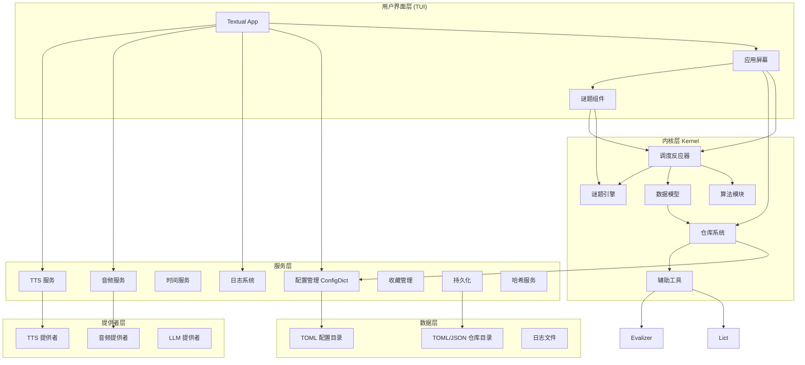
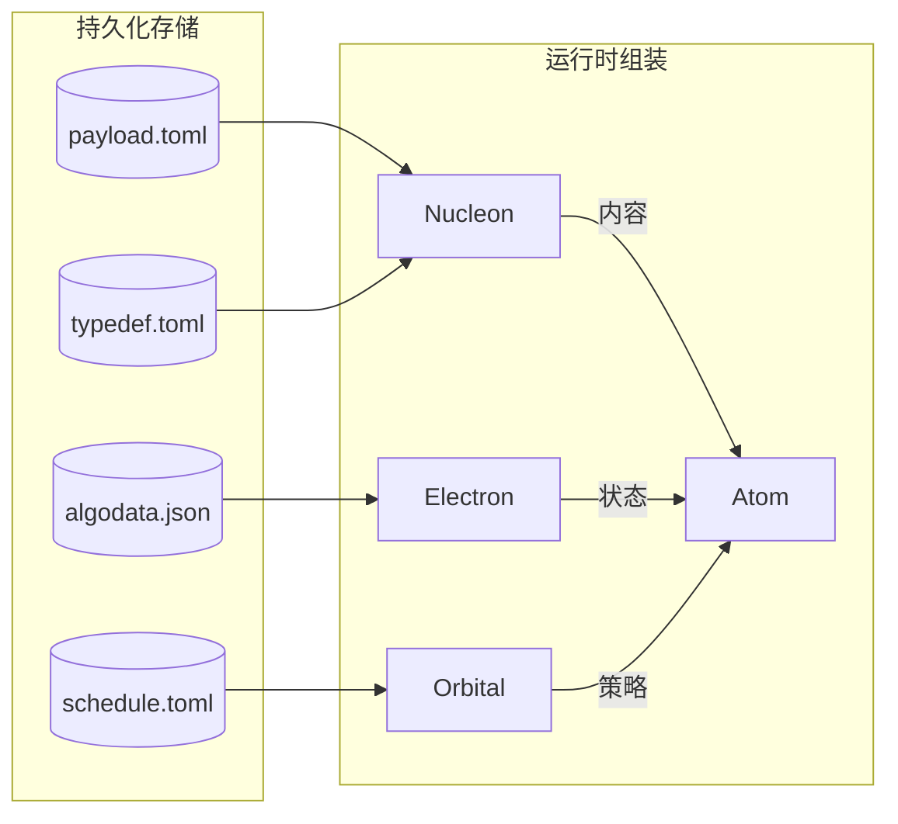
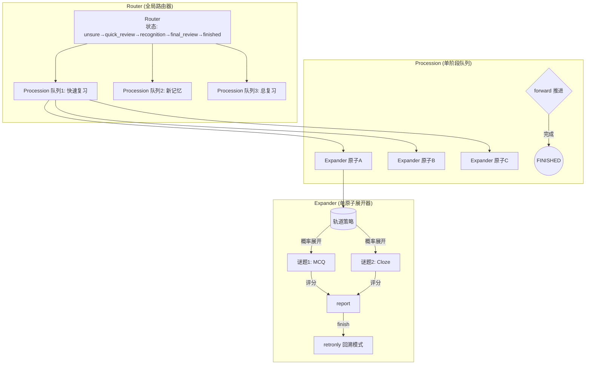
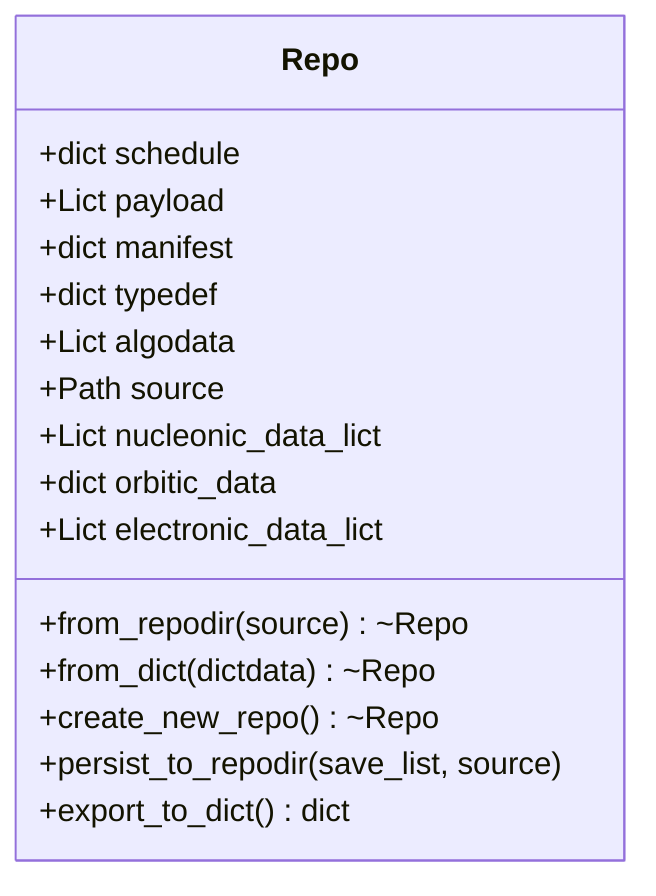
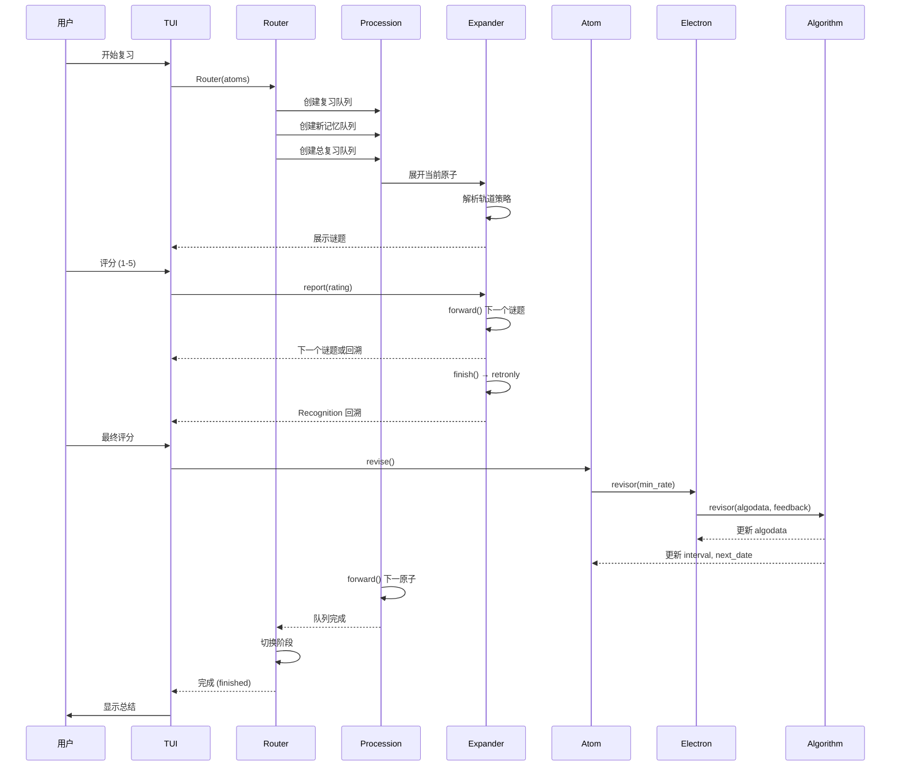

## 整体架构概览



## 数据模型

项目以物理粒子隐喻为核心, 将记忆单元拆解为三个模型:

### Nucleon (核子) — 内容层

```
Nucleon(ident, payload, common)
```

- **只读**内容容器. 通过 `Evalizer` (基于 `eval()` 的模板系统)对 payload 和 common 进行编译展开. 
- 包含 `puzzles` 字段, 定义该记忆单元支持哪些谜题类型. 
- 从 `repo.payload` 和 `repo.typedef["common"]` 配对创建. 
- 一旦创建, 内容不可修改 (`__setitem__` 抛出 `AttributeError`). 

### Electron (电子) — 状态层

```
Electron(ident, algodata, algo_name)
```

- 算法状态数据的包装器. 每个 Electron 绑定一个算法 (`algorithms[algo_name]`). 
- `algodata` 是到仓库 `algodata.lict` 中对应字典的**引用**, 修改即持久化. 
- 核心方法：`activate()` (标记激活)、`revisor()` (评分迭代)、`is_due()` (到期判断). 

### Orbital (轨道) — 策略层

```
orbital = {
    "schedule": ["quick_review", "recognition"],
    "routes": {
        "quick_review": [["MCQ", "1.0"], ["Cloze", "0.5"]],
        "recognition": [["Recognition", "1.0"]],
    }
}
```

- 定义复习阶段流程和各阶段内谜题选择策略的纯字典. 
- 每个阶段对应一组 `(谜题类型, 概率系数)` 元组列表, 概率系数 >1 的部分表示强制重复次数. 

### Atom (原子) — 运行时组装

```
Atom(nucleon, electron, orbital)
```

- 三者的运行时组合, 附带 `runtime` 运行时标志 (`locked`, `min_rate`, `new_activation`). 
- 是 UI 和调度层操作的基本单位. 
- `revise()` 方法在 `locked` 为真时调用 `electron.revisor(min_rate)`, 执行最终评分迭代. 

**关系图**：



---

## 调度反应器 (Reactor)

调度反应器是核心业务流程引擎, 采用三层嵌套的有限状态机设计 (基于 `transitions` 库). 

### 状态枚举定义

| 状态机 | 状态 | 说明 |
|--------|------|------|
| **RouterState** | `unsure` | 初始状态, 自动推进 |
| | `quick_review` | 快速复习阶段 |
| | `recognition` | 新记忆识别阶段 |
| | `final_review` | 最终总复习阶段 |
| | `finished` | 完成, 执行评分 |
| **ProcessionState** | `active` | 进行中 |
| | `finished` | 已完成 |
| **ExpanderState** | `exammode` | 考试模式 (正面答题) |
| | `retronly` | 回溯模式 (仅识别) |

### 三层嵌套结构



### 数据流详解

```
Router.__init__(atoms)
  │
  ├─ 新旧原子分流
  │   ├─ old_atoms → Procession(quick_review)  "初始复习"
  │   └─ new_atoms → Procession(recognition)    "新记忆"
  │
  └─ 所有原子 → Procession(final_review)        "总体复习"
        │
        └─ Procession.forward()
              │
              ├─ cursor >= len(atoms) → finish()
              └─ cursor < len(atoms)  → next_atom
                    │
                    └─ Procession.get_expander()
                          │
                          └─ Expander(atom, route)
                                │
                                ├─ 读取 orbital.routes[route_value]
                                ├─ 概率展开为谜题列表 self.puzzles_inf
                                ├─ exammode → 依次展示谜题
                                ├─ report(rating) → 记录最低评分
                                ├─ forward() → 下一个谜题或 finish → retronly
                                └─ retronly → 展示 Recognition
                                      │
                                      └─ Atom.revise()
                                            │
                                            └─ Electron.revisor(min_rate)
                                                  │
                                                  └─ Algorithm.revisor(algodata, feedback)
```

---

## 算法系统

所有算法继承自 `BaseAlgorithm`, 以类方法的风格实现, 通过 `algorithms` 字典注册. 

| 算法 | 文件 | 状态 | 说明 |
|------|------|------|------|
| **SM-2** | `sm2.py` | ✅ 完成 | 经典 SuperMemo 1987 算法 |
| **NSP-0** | `nsp0.py` | ✅ 完成 | 非间隔过滤调度器 |
| **SM-15M** | `sm15m.py` + `sm15m_calc.py` | ✅ 完成 | 从 CoffeeScript 移植的 SM-15 |
| **FSRS** | `fsrs.py` | ❌ 未实现 | 进度: `logger.info("尚未实现")` |
| **Base** | `base.py` | ✅ 基类 | 定义 `AlgodataDict` 结构和默认值 |

每个算法提供以下类方法：

| 方法 | 功能 |
|------|------|
| `revisor(algodata, feedback, is_new_activation)` | 根据评分迭代记忆数据 |
| `is_due(algodata)` | 判断是否到期复习 |
| `get_rating(algodata)` | 获取评分信息 |
| `nextdate(algodata)` | 获取下一次复习时间戳 |
| `check_integrity(algodata)` | 校验 algodata 数据结构完整性 |

### 算法数据结构 (AlgodataDict)

```python
{
    "real_rept": int,      # 实际复习次数
    "rept": int,           # 当前重复计数
    "interval": int,       # 间隔天数
    "last_date": int,      # 上次复习日期
    "next_date": int,      # 下次到期日期
    "is_activated": int,   # 是否已激活 (0/1)
    "last_modify": float,  # 最后修改时间戳
}
```

---

## 仓库系统 (Repo)

仓库是 TOML/JSON 文件目录, 无数据库依赖. 

### 目录结构

```
data/repo/<package_name>/
├── manifest.toml    # 元信息: title, author, package, desc
├── typedef.toml     # 通用元数据、谜题定义、注解
├── payload.toml     # 记忆条目 (key=ident)
├── algodata.json    # 算法状态 (key=ident)
└── schedule.toml    # 轨道/复习策略
```

### Repo 类设计



- `payload` 和 `algodata` 使用 `Lict` (列表+字典混合容器), 支持双模式访问. 
- `_generate_particles_data()` 在初始化时自动将 payload 数据转换为 `Nucleon` 所需的格式. 
- 默认保存列表 `default_save_list = ["algodata"]`, 仅持久化算法状态. 

---

## Lict 集合

`Lict` 继承 `MutableSequence`, 同时维护列表和字典访问：

```python
lict = Lict()
lict.append(("key1", value1))  # 列表追加
lict["key1"]                    # 字典访问
lict[0]                         # 索引访问
lict.keys()                     # 所有键
lict.dicted_data                # 纯字典导出
```

脏同步机制：修改列表时自动同步字典, 修改字典时自动同步列表. 用于 `payload` 和 `algodata` 的双模式访问需求. 

---

## 配置系统 (ConfigDict)

`ConfigDict` 继承 `UserDict`, 是**单例模式**的 TOML 懒加载配置管理器. 

### 配置目录约定

```
data/config/
├── _.toml              # 顶层默认值 (递归合并)
├── interface/
│   ├── _.toml          # interface 层默认值
│   ├── global.toml
│   └── puzzles.toml
├── services/
│   ├── _.toml          # services 层默认值
│   ├── audio.toml
│   └── tts.toml
└── repo/
    └── _.toml
```

- `_.toml` 文件 = 该目录层级的默认值, 合并到父级
- 带后缀文件 = 按需懒加载
- 子目录 = 递归子配置

### 上下文管理

```python
from heurams.context import config_var, ConfigContext

# 全局访问
config = config_var.get()
algo = config["interface"]["global"]["algorithm"]

# 作用域覆盖
with ConfigContext(test_config):
    ...  # 临时使用测试配置
```

---

## 提供者系统 (Providers)

可插拔的后端实现, 通过 `providers/__init__.py` 中的字典注册. 

| 类别 | 提供者 | 说明 |
|------|--------|------|
| **TTS** | `edge_tts` | Microsoft Edge TTS (在线) |
| | `basetts` | 桩基类 (未实现) |
| **Audio** | `playsound` | 跨平台音频播放 |
| | `termux` | Android Termux 环境 |
| **LLM** | `openai` | OpenAI 兼容 API (未完整实现) |

选择方式：`services/*.toml` 中的 `provider` 字段. 

---

## 谜题系统 (Puzzles)

谜题引擎用于在复习阶段生成评估视图：

| 谜题 | 文件 | 说明 |
|------|------|------|
| **MCQ** | `mcq.py` | 选择题 (Multiple Choice) |
| **Cloze** | `cloze.py` | 完形填空 (Cloze Deletion) |
| **Recognition** | `recognition.py` | 认读识别 |
| **Guess** | `guess.py` | 猜测词义 |
| **Base** | `base.py` | 抽象基类 |

谜题通过轨道策略 (Orbital)在 `Expander` 中按概率展开, 每个原子可产生多个谜题, 每个谜题独立评分. 

---

## 服务层

| 服务 | 文件 | 说明 |
|------|------|------|
| **Config** | `config.py` | `ConfigDict(UserDict)` TOML 懒加载单例 |
| **Logger** | `logger.py` | `get_logger(name)` → 层级日志 (`heurams.*`) |
| **Timer** | `timer.py` | `get_daystamp()` / `get_timestamp()`, 支持可配置覆盖 |
| **Audio** | `audio_service.py` | 音频播放, 路由到配置的音频提供者 |
| **TTS** | `tts_service.py` | 文本转语音, 路由到配置的 TTS 提供者 |
| **Favorites** | `favorite_service.py` | JSON5 持久化的收藏管理器 (单例) |
| **Attic** | `attic.py` | 结构化 pickle 持久化, 支持 `<DAYSTAMP>`/`<TIMESTAMP>` 占位符 |
| **Hasher** | `hasher.py` | MD5 哈希 |
| **Epath** | `epath.py` | 点符号嵌套字典访问 (`epath(dct, "a.b.c")`) |
| **TextProc** | `textproc.py` | `truncate()`, `domize()`, `undomize()` |

日志系统：每个模块通过 `get_logger(__name__)` 创建自己的日志器, 日志文件 10MB 轮转, 最多 5 个备份, 追加到 `heurams.log`. 

---

## 复习全流程



---

## 关键设计决策

1. **无数据库** — 所有持久化基于 TOML/JSON 文件目录, 方便版本管理和手动编辑. 
2. **Lict 双模式访问** — payload 和 algodata 同时支持列表迭代和字典查找, 兼顾批处理和随机访问. 
3. **物理隐喻分离** — 内容 (Nucleon)、状态 (Electron)、策略 (Orbital) 三者正交, 可独立替换, 便于组合不同算法和内容类型. 
4. **transitions 状态机** — 使用 `transitions` 库实现 Router → Procession → Expander 三层嵌套状态机, 每个层次职责明确. 
5. **Evalizer eval 模板** — 使用 `eval()` 实现动态模板替换, 功能灵活但存在安全风险 (标记为待替换). 
6. **配置单例** — `ConfigDict` 以规范化路径为键实现单例, 避免多实例导致的配置不一致问题. 
7. **评分累积** — 原子在多谜题阶段的最终评分取所有谜题的最低评分 (`min_rate`), 确保严格评估. 
