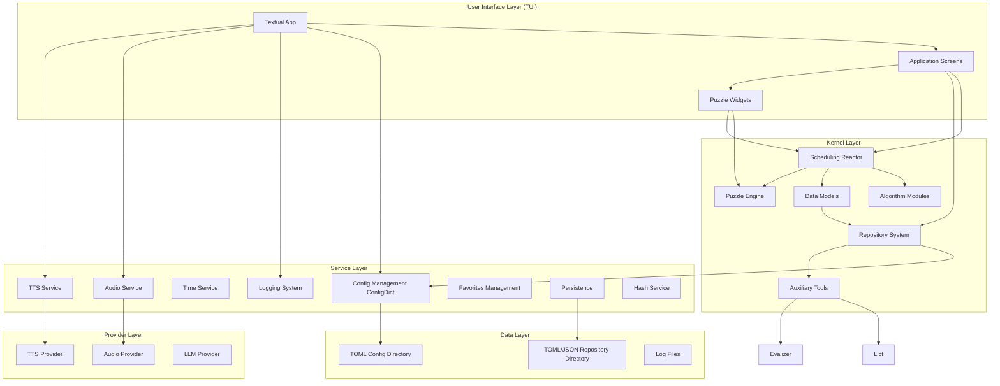
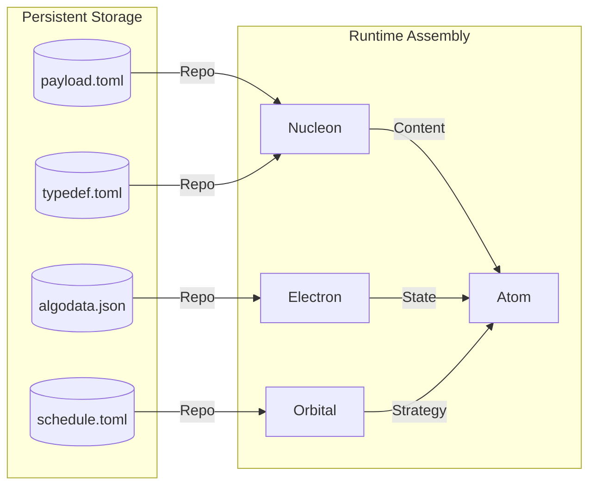
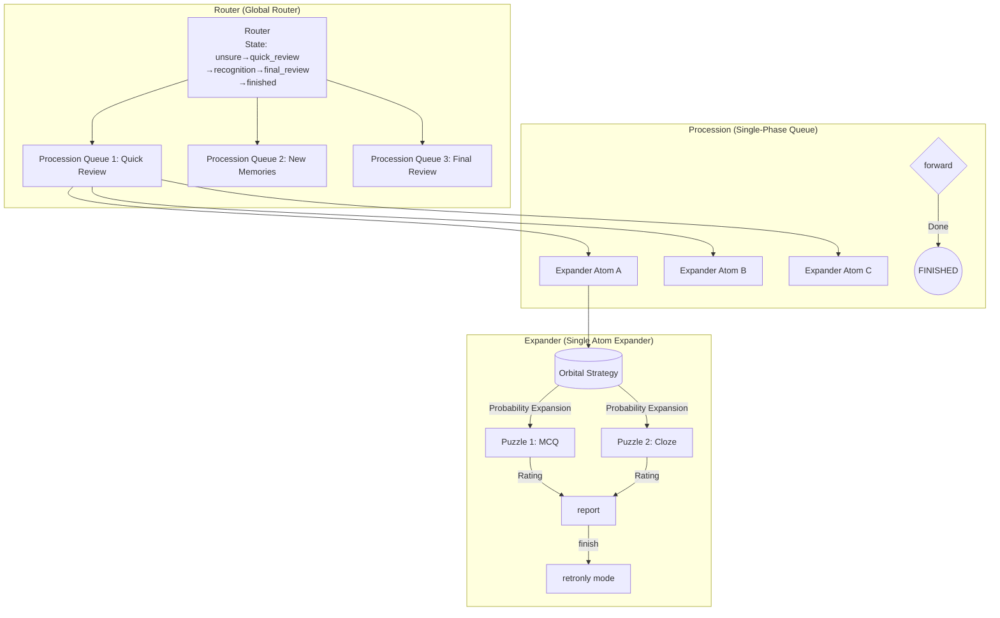
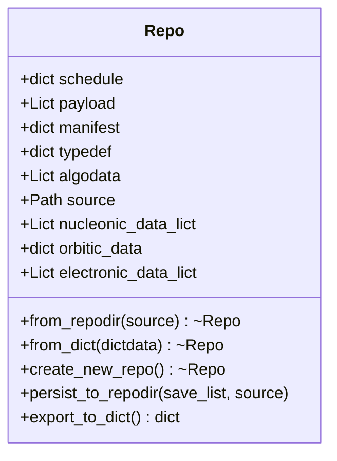
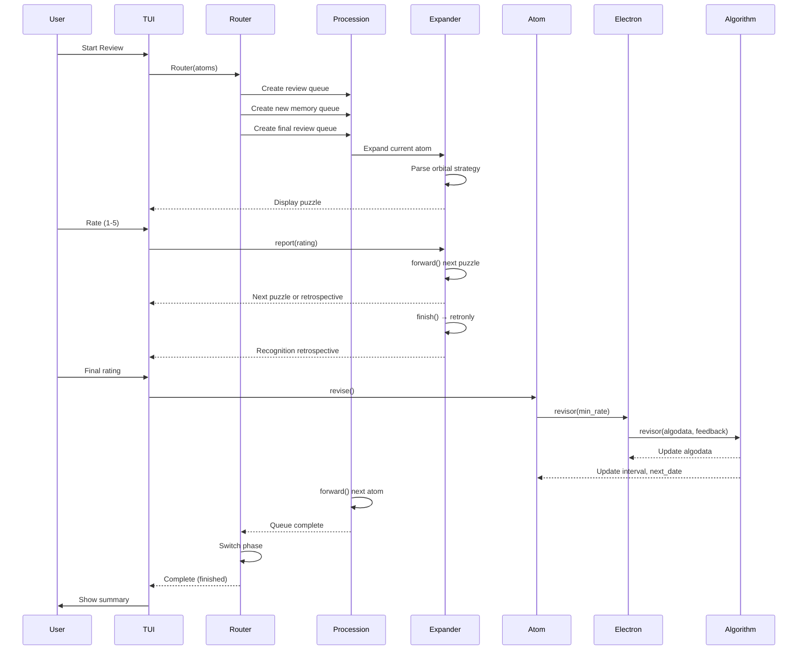

## Overall Architecture Overview



## Data Model

The project uses the physical particle metaphor as its core, decomposing memory units into three models:

### Nucleon - Content Layer

```
Nucleon(ident, payload, common)
```

- **Read-only** content container. Compiles and expands `payload` and `common` via `Evalizer` (an `eval()`-based template system).
- Contains `puzzles` field, defining which puzzle types this memory unit supports.
- Created by pairing `repo.payload` and `repo.typedef["common"]`.
- Once created, content cannot be modified (`__setitem__` raises `AttributeError`).

### Electron - State Layer

```
Electron(ident, algodata, algo_name)
```

- Wrapper for algorithm state data. Each Electron is bound to one algorithm (`algorithms[algo_name]`).
- `algodata` is a **reference** to the corresponding dictionary in the repository's `algodata.lict` — modifications are persisted immediately.
- Core methods: `activate()` (mark as activated), `revisor()` (rating iteration), `is_due()` (due check).

### Orbital - Strategy Layer

```
orbital = {
    "schedule": ["quick_review", "recognition"],
    "routes": {
        "quick_review": [["MCQ", "1.0"], ["Cloze", "0.5"]],
        "recognition": [["Recognition", "1.0"]],
    }
}
```

- A plain dictionary defining the review phase flow and puzzle selection strategy within each phase.
- Each phase corresponds to a list of `(puzzle_type, probability_coefficient)` tuples; coefficients >1 indicate forced repetition count.

### Atom - Runtime Assembly

```
Atom(nucleon, electron, orbital)
```

- Runtime composition of the three, with `runtime` flags (`locked`, `min_rate`, `new_activation`).
- The basic unit operated on by the UI and scheduling layers.
- `revise()` calls `electron.revisor(min_rate)` when `locked` is true, performing the final rating iteration.

**Relationship Diagram**:



## Scheduling Reactor

The Scheduling Reactor is the core business process engine, designed as a three-layer nested finite state machine (based on the `transitions` library).

### State Enumeration

| State Machine | State | Description |
|---------------|-------|-------------|
| **RouterState** | `unsure` | Initial state, auto-advances |
| | `quick_review` | Quick review phase |
| | `recognition` | New memory recognition phase |
| | `final_review` | Final comprehensive review phase |
| | `finished` | Complete, execute rating |
| **ProcessionState** | `active` | In progress |
| | `finished` | Completed |
| **ExpanderState** | `exammode` | Exam mode (frontal answering) |
| | `retronly` | Retrospective mode (recognition only) |

### State Machine Nesting Structure



### Data Flow Detail

```
Router.__init__(atoms)
  │
  ├─ Split atoms into new/old
  │   ├─ old_atoms → Procession(quick_review)  "Initial review"
  │   └─ new_atoms → Procession(recognition)    "New memories"
  │
  └─ all atoms → Procession(final_review)       "Final review"
        │
        └─ Procession.forward()
              │
              ├─ cursor >= len(atoms) → finish()
              └─ cursor < len(atoms)  → next_atom
                    │
                    └─ Procession.get_expander()
                          │
                          └─ Expander(atom, route)
                                │
                                ├─ Read orbital.routes[route_value]
                                ├─ Probability expansion → self.puzzles_inf
                                ├─ exammode → display puzzles sequentially
                                ├─ report(rating) → record minimum rating
                                ├─ forward() → next puzzle or finish → retronly
                                └─ retronly → display Recognition
                                      │
                                      └─ Atom.revise()
                                            │
                                            └─ Electron.revisor(min_rate)
                                                  │
                                                  └─ Algorithm.revisor(algodata, feedback)
```

Rating accumulation: The final rating for an atom across multiple puzzles takes the minimum rating (`min_rate`) across all puzzles, ensuring strict evaluation.

## Algorithm System

All algorithms inherit from `BaseAlgorithm`, implemented in a class-method style, registered via the `algorithms` dictionary.

| Algorithm | File | Status | Description |
|-----------|------|--------|-------------|
| **SM-2** | `sm2.py` | ✅ Complete | Classic SuperMemo 1987 algorithm |
| **NSP-0** | `nsp0.py` | ✅ Complete | Non-spaced filtering scheduler |
| **SM-15M** | `sm15m.py` | ✅ Complete | SM-15 ported from CoffeeScript |
| **FSRS** | `fsrs.py` | ✅ Partial | Optimizer not available |
| **Base** | `base.py` | ✅ Base class | Defines `AlgodataDict` structure and defaults |

Each algorithm provides the following class methods:

| Method | Function |
|--------|----------|
| `revisor(algodata, feedback, is_new_activation)` | Iterate memory data based on rating |
| `is_due(algodata)` | Check if due for review |
| `get_rating(algodata)` | Get rating information |
| `nextdate(algodata)` | Get next review timestamp |
| `check_integrity(algodata)` | Validate algodata data structure integrity |

### Algorithm Data Structure (AlgodataDict)

```python
{
    "real_rept": int,      # Actual review count
    "rept": int,           # Current repetition count
    "interval": int,       # Interval in days
    "last_date": int,      # Last review date
    "next_date": int,      # Next due date
    "is_activated": int,   # Whether activated (0/1)
    "last_modify": float,  # Last modification timestamp
}
```

## Repository System (Repo)

The repository is a directory of TOML/JSON files with no database dependency.

### Directory Structure

```
data/repo/<package_name>/
├── manifest.toml    # Meta info: title, author, package, desc
├── typedef.toml     # Common metadata, puzzle definitions, annotations
├── payload.toml     # Memory items (key=ident)
├── algodata.json    # Algorithm state (key=ident)
└── schedule.toml    # Orbital/review strategy
```

### Repo Class Design



- `payload` and `algodata` use `Lict` (list+dict hybrid container), supporting dual-mode access.
- `_generate_particles_data()` automatically converts payload data to `Nucleon`-required format during initialization.
- Default save list: `default_save_list = ["algodata"]`, only persists algorithm state.

## Lict Collection

`Lict` extends `MutableSequence`, maintaining both list and dictionary access:

```python
lict = Lict()
lict.append(("key1", value1))  # List append
lict["key1"]                    # Dict access
lict[0]                         # Index access
lict.keys()                     # All keys
lict.dicted_data                # Plain dict export
```

Dirty sync mechanism: modifying the list automatically syncs to the dictionary; modifying the dictionary automatically syncs to the list. Used for dual-mode access to `payload` and `algodata`.

## Configuration System (ConfigDict)

`ConfigDict` extends `UserDict`, a **singleton** TOML lazy-loading configuration manager.

### Configuration Directory Convention

```
data/config/
├── _.toml              # Top-level defaults (recursive merge)
├── interface/
│   ├── _.toml          # Interface layer defaults
│   ├── global.toml
│   └── puzzles.toml
├── services/
│   ├── _.toml          # Services layer defaults
│   ├── audio.toml
│   └── tts.toml
└── repo/
    └── _.toml
```

- `_.toml` files = defaults for that directory level, merged into parent
- Suffixed files = lazy-loaded on demand
- Subdirectories = recursive sub-configuration

### Context Management

```python
from heurams.context import config_var, ConfigContext

# Global access
config = config_var.get()
algo = config["interface"]["global"]["algorithm"]

# Scope override
with ConfigContext(test_config):
    ...  # Temporarily use test configuration
```

## Provider System (Providers)

Pluggable backend implementations, registered via dictionaries in `providers/__init__.py`.

| Category | Provider | Description |
|----------|----------|-------------|
| **TTS** | `edge_tts` | Microsoft Edge TTS (online) |
| | `basetts` | Stub base class (not implemented) |
| **Audio** | `playsound` | Cross-platform audio playback |
| | `termux` | Android Termux environment |
| **LLM** | `openai` | OpenAI compatible API (not fully implemented) |

Selection method: `provider` field in `services/*.toml`.

## Puzzle System (Puzzles)

The puzzle engine generates evaluation views during review phases:

| Puzzle | File | Description |
|--------|------|-------------|
| **MCQ** | `mcq.py` | Multiple Choice Questions |
| **Cloze** | `cloze.py` | Cloze Deletion |
| **Recognition** | `recognition.py` | Recognition identification |
| **Guess** | `guess.py` | Word meaning guessing |
| **Base** | `base.py` | Abstract base class |

Puzzles are expanded probabilistically by the Orbital strategy in the `Expander`. Each atom can generate multiple puzzles, and each puzzle is rated independently.

## Service Layer

| Service | File | Description |
|---------|------|-------------|
| **Config** | `config.py` | `ConfigDict(UserDict)` TOML lazy-loading singleton |
| **Logger** | `logger.py` | `get_logger(name)` → hierarchical logger (`heurams.*`) |
| **Timer** | `timer.py` | `get_daystamp()` / `get_timestamp()`, supports configurable override |
| **Audio** | `audio_service.py` | Audio playback, routes to configured audio provider |
| **TTS** | `tts_service.py` | Text-to-speech, routes to configured TTS provider |
| **Favorites** | `favorite_service.py` | JSON5-persisted favorites manager (singleton) |
| **Attic** | `attic.py` | Structured pickle persistence, supports `<DAYSTAMP>`/`<TIMESTAMP>` placeholders |
| **Hasher** | `hasher.py` | MD5 hashing |
| **Epath** | `epath.py` | Dot-notation nested dict access (`epath(dct, "a.b.c")`) |
| **TextProc** | `textproc.py` | `truncate()`, `domize()`, `undomize()` |

Logging system: Each module creates its own logger via `get_logger(__name__)`. Log files rotate at 10MB, max 5 backups, appended to `heurams.log`.

## Complete Review Flow


