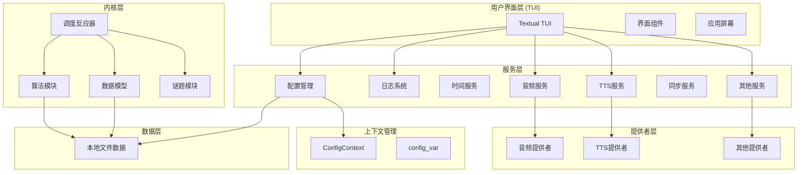

# 项目架构

## 架构图(待更新 0.5.0)

以下 Mermaid 图展示了 HeurAMS 的主要组件及其关系:

```mermaid
graph TB
    subgraph "用户界面层 (TUI)"
        TUI[Textual TUI]
        Widgets[界面组件]
        Screens[应用屏幕]
    end

    subgraph "服务层"
        Config[配置管理]
        Logger[日志系统]
        Timer[时间服务]
        AudioService[音频服务]
        TTSService[TTS服务]
        SyncService[同步服务]
        OtherServices[其他服务]
    end

    subgraph "内核层"
        Algorithms[算法模块]
        Particles[数据模型]
        Puzzles[谜题模块]
        Reactor[调度反应器]
    end

    subgraph "提供者层"
        AudioProvider[音频提供者]
        TTSProvider[TTS提供者]
        OtherProviders[其他提供者]
    end

    subgraph "数据层"
        Files[本地文件数据]
    end

    subgraph "上下文管理"
        Context[ConfigContext]
        CtxVar[config_var]
    end

    TUI --> Config
    TUI --> Logger
    TUI --> AudioService
    TUI --> TTSService
    TUI --> OtherServices
    Config --> Files
    Config --> Context
    AudioService --> AudioProvider
    TTSService --> TTSProvider
    OtherServices --> OtherProviders
    Reactor --> Algorithms
    Reactor --> Particles
    Reactor --> Puzzles
    Particles --> Files
    Algorithms --> Files
```
