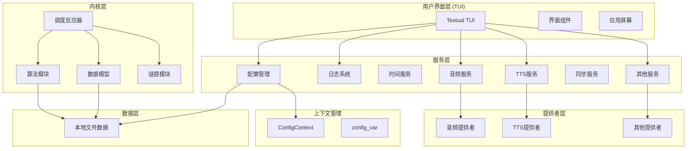

# 潜进 (HeurAMS) - 启发式辅助记忆程序

## 概述
"潜进" (HeurAMS: Heuristic Auxiliary Memorizing Scheduler, 启发式记忆辅助调度器) 是为习题册, 古诗词, 及其他问答/记忆/理解型知识设计的开放源代码多用途辅助记忆软件, 提供动态规划的优化记忆方案  

## 关于此仓库
本仓库为 "潜进" 软件组项目的核心部分, 包含核心功能模块以及基于 Textual 框架的基础用户界面(heurams.interface)实现  
除了通过用户界面进行学习外, 你也可以在 Python 中导入 `heurams` 库, 使用其中实现的状态机, 算法迭代器和数据模型构建辅助记忆功能  
本仓库在 AGPLv3 下开放源代码(详见 LICENSE 文件)  

## 版本日志
- 0.0.x: 简易调度器实现与最小原型.  
- 0.1.x: 命令行操作的调度器.  
- 0.2.x: 使用 Textual 构建富文本终端用户界面; 项目可行性验证; 采用 SM-2 原始算法, 评估方式为用户自评估原型.  
- 0.3.x: 简单的多文件项目; 创建了记忆内容/算法数据结构; 基于 SM-2 改进算法的自动复习测评评估; 重点设计古诗文记忆理解功能; TUI 界面改进; 简单的 TTS 集成.  
- 0.4.x: 开发目标转为多用途; 使用模块管理解耦设计; 增加文档与类型标注; 采用上下文设计模式的隐式依赖注入与遵从 IoC, 注册器设计的算法与功能实现; 支持其他调度算法模块 (SM-2, SM-18M 逆向工程实现, FSRS) 与谜题模块; 采用日志调试; 更新文件格式; 引入动态数据模式(宏驱动的动态内容生成), 与基于文件的策略调控; 更佳的用户数据处理; 加入模块化扩展集成; 将算法数据格式换为 json 提高性能; 采用 provider-service 抽象架构, 支持切换服务提供者; 整体兼容性改进.  
- 0.5.x: 以仓库(repo)对象作为文件系统与运行时对象间的桥梁, 提高解耦性与性能; 使用具有列表 - 字典 API 同步特性的 "Lict" 对象作为 Repo 数据的内部存储; 将粒子对象作为纯运行时对象, 数据通过引用自动同步至 Repo, 减少负担; 实现声音形式回顾 "电台" 功能; 改进数据存储结构, 实现选择性持久化; 增强可配置性; 使用 Transitions 状态机库重新实现 reactor 状态机, 增强可维护性; 实现整体回顾记忆功能, 与队列式记忆功能并列; 加入状态机快照功能(基于 pickle), 使中断的记忆流程得以恢复; 增加"整体文章引用"功能, 实现从一篇长文本中摘取内容片段记忆并在原文中高亮查看的组织操作.  
> 下一步?  
> 使用 Flutter 构建酷酷的现代化前端, 增加云同步/文档源服务...

## 特性

### 间隔迭代算法
> 许多出版物都广泛讨论了不同重复间隔对学习效果的影响. 特别是, 间隔效应被认为是一种普遍现象. 间隔效应是指, 如果重复的间隔是分散/稀疏的, 而不是集中重复, 那么学习任务的表现会更好. 因此, 有观点提出, 学习中使用的最佳重复间隔是**最长的、但不会导致遗忘的间隔**. 
- 采用经实证的 SM-2 间隔迭代算法, 此算法亦用作 Anki 闪卡记忆软件的默认闪卡调度器
- 动态规划每个记忆单元的记忆间隔时间表
- 动态跟踪记忆反馈数据, 优化长期记忆保留率与稳定性

### 学习进程优化
- 逐字解析: 支持逐字详细释义解析
- 语法分析: 接入生成式人工智能, 支持古文结构交互式解析
- 自然语音: 集成微软神经网络文本转语音 (TTS) 技术
- 多种谜题类型: 选择题 (MCQ)、填空题 (Cloze)、识别题 (Recognition)
- 动态内容生成: 支持宏驱动的模板系统, 根据上下文动态生成题目
- 云同步支持: 通过 WebDAV 协议同步数据到远程服务器

### 实用用户界面
- 响应式 Textual 框架构建的跨平台 TUI 界面
- 支持触屏/鼠标/键盘多操作模式
- 简洁直观的复习流程设计

### 架构特性
- 模块化设计: 算法、谜题、服务提供者可插拔替换
- 上下文管理: 使用 ContextVar 实现隐式依赖注入
- 数据持久化: TOML 配置与内容, JSON 算法状态
- 服务抽象: 音频播放、TTS、LLM 通过 provider 架构支持多种后端
- 完整日志系统: 带轮转的日志记录, 便于调试

## 安装

### 从源码安装
1. 克隆仓库: 
   ```bash
   git clone https://gitea.imwangzhiyu.xyz/ajax/HeurAMS
   cd HeurAMS
   ```

2. 安装依赖: 
   ```bash
   pip install -r requirements.txt
   ```

3. 以开发模式安装包: 
   ```bash
   pip install -e .
   ```

## 使用

### 启动应用
```bash
# 在任一目录(建议是空目录或者包根目录, 将被用作存放数据)下运行
python -m heurams.interface
```

### 数据目录结构
应用会在工作目录下创建以下数据目录: 
- `data/nucleon/`: 记忆内容 (TOML 格式)
- `data/electron/`: 算法状态 (JSON 格式)
- `data/orbital/`: 策略配置 (TOML 格式)
- `data/cache/`: 音频缓存文件
- `data/template/`: 内容模板

首次运行时会自动创建这些目录.

## 配置

配置文件位于 `config/config.toml`(相对于工作目录). 如果不存在, 会使用内置的默认配置.

### 同步配置
同步功能支持 WebDAV 协议，可在配置文件的 `[sync.webdav]` 段进行配置：
```toml
[sync.webdav]
enabled = false
url = ""                    # WebDAV 服务器地址
username = ""               # 用户名
password = ""               # 密码
remote_path = "/heurams/"   # 远程路径
sync_mode = "bidirectional" # 同步模式: bidirectional/upload_only/download_only
conflict_strategy = "newer" # 冲突策略: newer/ask/keep_both
verify_ssl = true           # SSL 证书验证
```

启用同步后，可通过应用内的同步工具进行数据备份和恢复。 

## 项目结构

### 架构图(待更新 0.5.0)

以下 Mermaid 图展示了 HeurAMS 的主要组件及其关系: 



### 目录结构(待更新 0.5.0)
```
src/heurams/
├── __init__.py              # 包入口点
├── context.py               # 全局上下文、路径、配置上下文管理器
├── services/                # 核心服务
│   ├── config.py            # 配置管理
│   ├── logger.py            # 日志系统
│   ├── timer.py             # 时间服务
│   ├── audio_service.py     # 音频播放抽象
│   ├── tts_service.py       # 文本转语音抽象
│   └── sync_service.py      # WebDAV 同步服务
├── kernel/                  # 核心业务逻辑
│   ├── algorithms/          # 间隔重复算法 (FSRS, SM2)
│   ├── particles/           # 数据模型 (Atom, Electron, Nucleon, Orbital)
│   ├── puzzles/             # 谜题类型 (MCQ, cloze, recognition)
│   └── reactor/             # 调度和处理逻辑
├── providers/               # 外部服务提供者
│   ├── audio/               # 音频播放实现
│   ├── tts/                 # 文本转语音实现
│   └── llm/                 # LLM 集成
├── interface/               # Textual TUI 界面
│   ├── widgets/             # UI 组件
│   ├── screens/             # 应用屏幕
│   └── __main__.py          # 应用入口点
└── default/                 # 默认配置和数据模板
```

## 贡献

欢迎贡献！请参阅 [CONTRIBUTING.md](CONTRIBUTING.md) 了解贡献指南. 

## 许可证

本项目基于 AGPL-3.0 许可证开源. 详见 [LICENSE](LICENSE) 文件. 