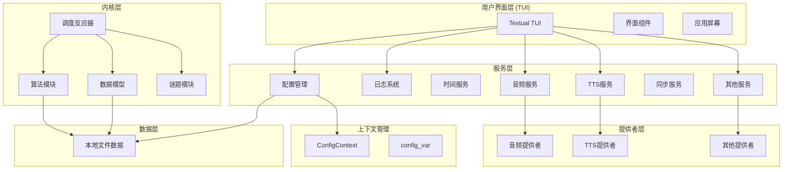

# 潜进 (HeurAMS) - 启发式辅助记忆程序

## 概述
"潜进" (HeurAMS: Heuristic Auxiliary Memorizing Scheduler, 启发式记忆辅助调度器) 是为习题册, 古诗词, 及其他问答/记忆/理解型知识设计的开放源代码多用途辅助记忆软件, 提供动态规划的优化记忆方案  

## 关于此仓库
本仓库为 "潜进" 软件组项目的核心部分, 包含核心功能模块以及基于 Textual 框架的基础用户界面(heurams.interface)实现  
除了通过用户界面进行学习外, 你也可以在 Python 中导入 `heurams` 库, 使用其中实现的状态机, 算法迭代器和数据模型构建辅助记忆功能  

## 特性

### 间隔迭代算法
> 许多出版物都广泛讨论了不同重复间隔对学习效果的影响. 特别是, 间隔效应被认为是一种普遍现象. 间隔效应是指, 如果重复的间隔是分散/稀疏的, 而不是集中重复, 那么学习任务的表现会更好. 因此, 有观点提出, 学习中使用的最佳重复间隔是**最长的, 但不会导致遗忘的间隔**. 
- 采用经实证的 SM-2 间隔迭代算法, 此算法亦用作 Anki 闪卡记忆软件的默认闪卡调度器
- 动态规划每个记忆单元的记忆间隔时间表
- 动态跟踪记忆反馈数据, 优化长期记忆保留率与稳定性

### 学习进程优化
- 元数据配置: 支持配置详细附加数据
- 自然语音: 集成文本转语音 (TTS) 功能, 支持"电台"回顾功能
- 多种谜题类型: 选择题 (MCQ), 填空题 (Cloze), 识别题 (Recognition)
- 动态内容生成: 支持宏驱动的模板系统, 根据上下文动态生成题目
- 云同步支持: 通过多种协议同步数据到远程服务器

### 实用用户界面
- 响应式 Textual 框架构建的跨平台 TUI 界面
- 支持触屏/鼠标/键盘多操作模式
- 简洁直观的复习流程设计

## 安装

### 从源码安装
1. 克隆仓库: 
   ```bash
   git clone https://gitea.imwangzhiyu.xyz/ajax/HeurAMS
   cd HeurAMS
   ```

2. 安装依赖: 
   ```bash
   pip install -r requirements.txt
   ```

3. 以开发模式安装包: 
   ```bash
   pip install -e .
   ```

### 从包管理器安装
暂时还没有:(  

## 启动应用
```bash
# 在任一目录(建议是空目录或者包根目录, 将被用作存放数据)下运行
python -m heurams.interface
```

配置文件位于 `./data/config/config.toml`(相对于工作目录).  
如果不存在, 会使用内置的默认配置.

## 项目结构

### 架构图(待更新 0.5.0)

以下 Mermaid 图展示了 HeurAMS 的主要组件及其关系: 



## 贡献

欢迎贡献！请参阅 [CONTRIBUTING.md](CONTRIBUTING.md) 了解贡献指南. 

## 许可证

### 项目本身

本项目基于 AGPL-3.0 许可证开源. 详见根目录下 [LICENSE](LICENSE) 文件. 

### 第三方代码

项目在 `src/heurams/vendor/` 目录下嵌入了以下第三方代码(可能有修改):

#### py-fsrs
- 上游版本: 6.3.1
- 位置: `src/heurams/vendor/pyfsrs/`
- 原项目: [py-fsrs](https://github.com/open-spaced-repetition/py-fsrs)
- 原许可证: Copyright (c) 2026 Open Spaced Repetition Contributors
- 原许可证: MIT License, 详见 `src/heurams/vendor/pyfsrs/LICENSE`

本项目受益于他们无私且优秀的工作