# 截图展示

潜进 (HeurAMS) 项目目前有两个前端实现, 此文档用于呈现它们的截图: 

- Textual (基本用户界面): 基于 Python Textual 框架构建的程序库内置跨平台 TUI 界面, 支持触屏、鼠标、键盘多操作模式, 是当前开箱即用的默认前端.
- KiriMemo: 基于 KDE `Kirigami` 框架的现代跨平台前端, 使用 C++ 和 QML 构建, 通过 `PyOtherSide` 直接复用 Python 内核，为 Windows、Linux、macOS、Android、iOS 和 Plasma Mobile 提供原生体验(尚未稳定).

欢迎为现有前端贡献代码, 或开发您自己的前端.  
详见[贡献指南](CONTRIBUTING.md#新的用户界面前端).

## 基本用户界面前端的截图

### 仪表盘与导航器

仪表盘包含学习面板的总体视图, 包括不同功能区域的操作入口, 统计信息, 以及单元集概览.  
导航器是一个实用的模态窗口, 能带您在多种功能间自如切换, 按 `n` 键或单击下方按钮可在任意界面迅速打开/关闭导航器.  

  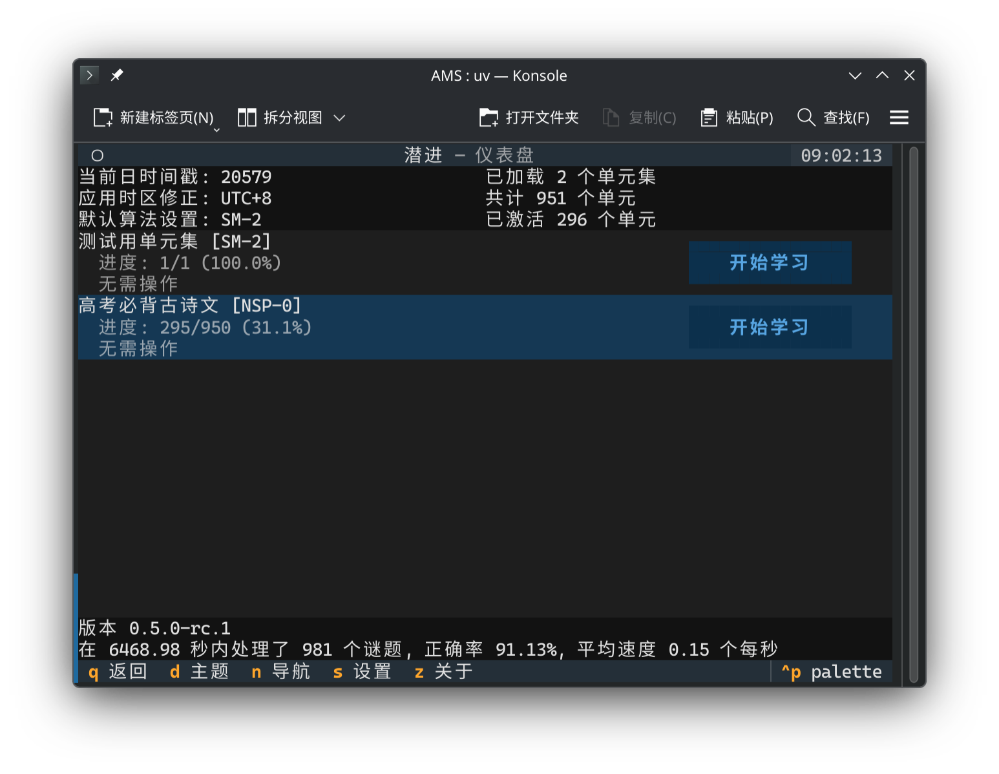
  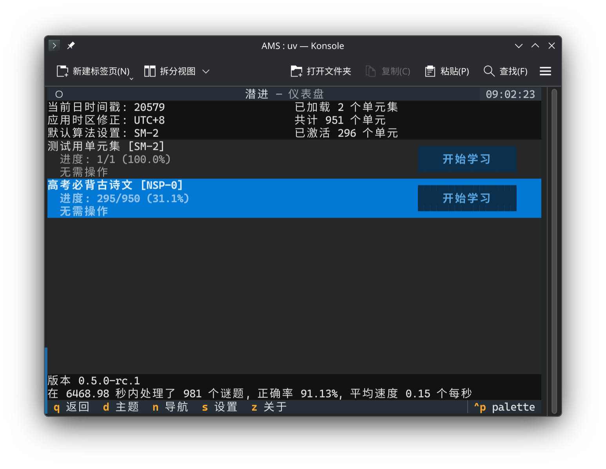
  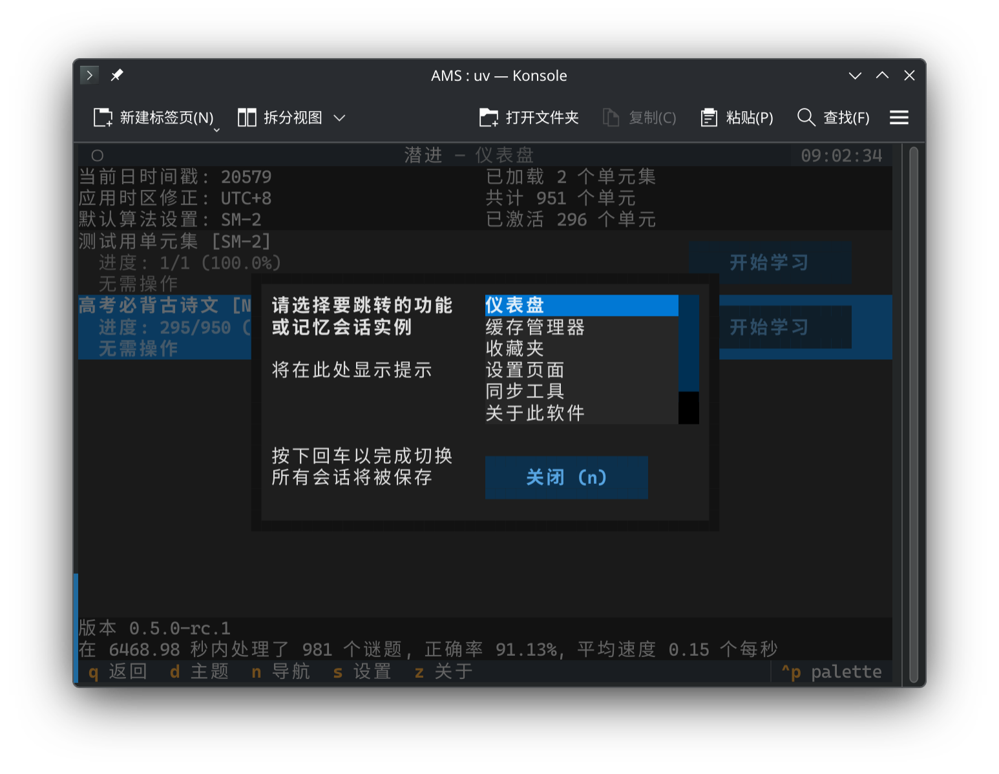

### 准备界面与预缓存工具

学习准备界面展示了单元集基本信息和每个单元的学习状态, 并提供了学习和预缓存的入口.
预缓存工具使您能提前预缓存文本转语音资源以确保复习流程的顺畅体验和离线复习能力, 但即使您不预先缓存, 资源也会在复习播放时被自动加载.

  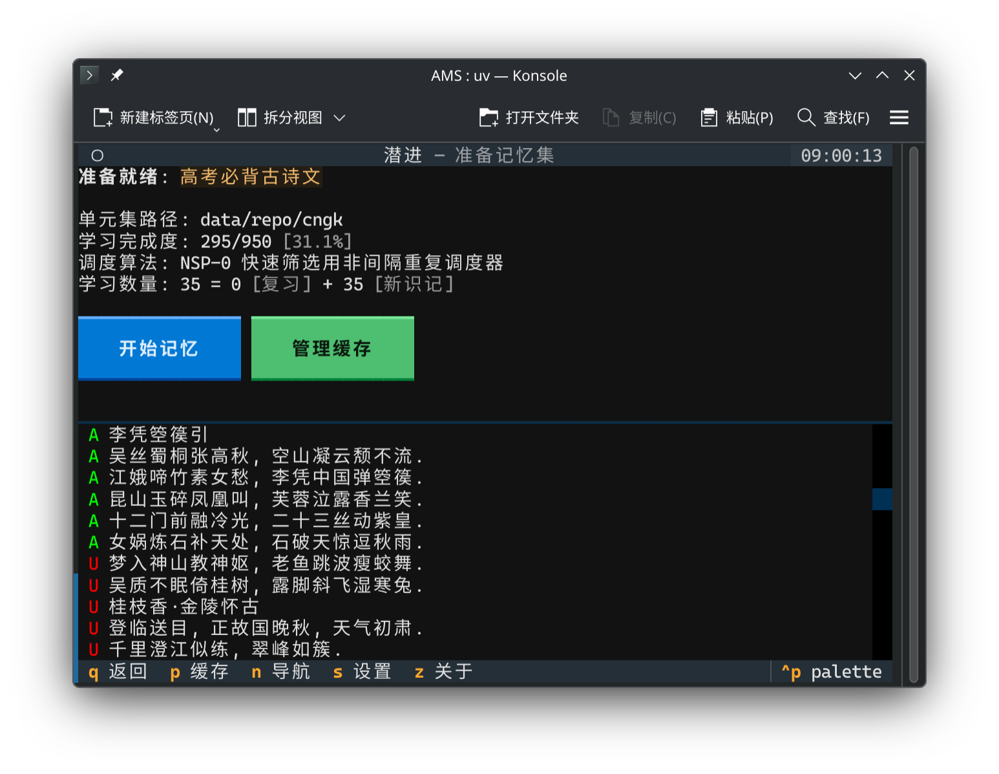
  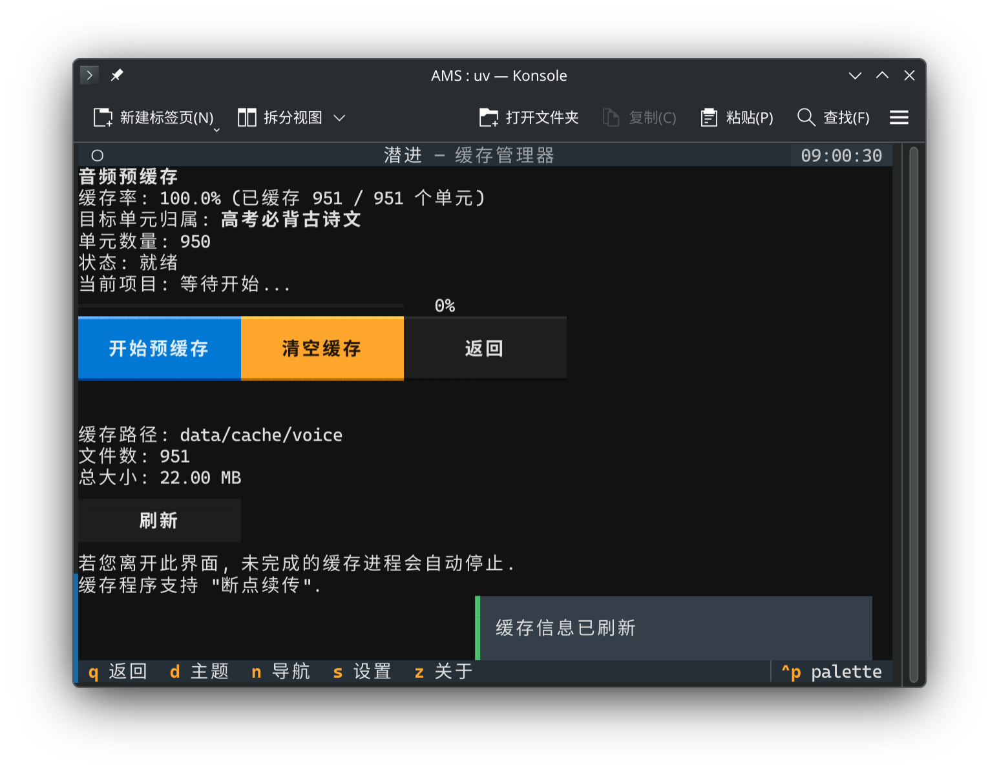

### 记忆队列界面

队列式学习记忆的主要界面.  
同一知识点可产生多种谜题类型的评估方式, 软件内置完形填空与识别题等多种测试类型, 您可在复习流程中按顺序完成不同测试.

  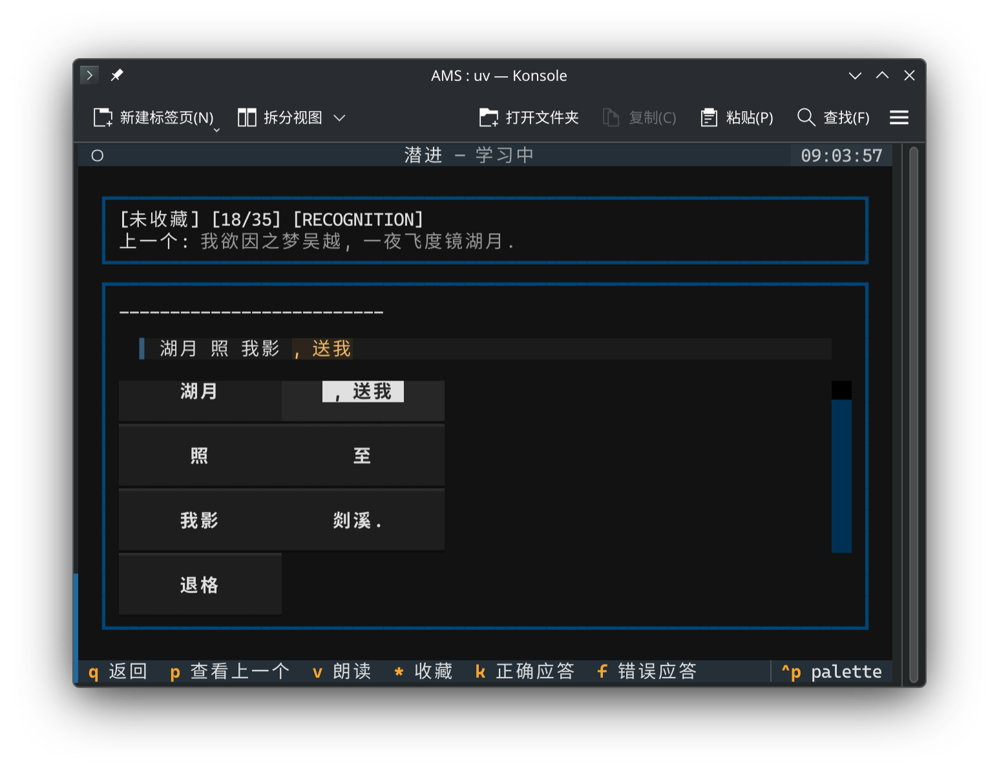
  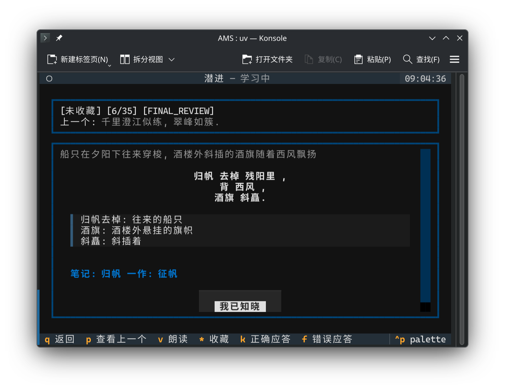
  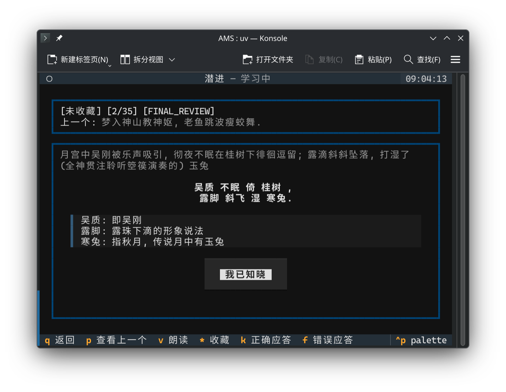

### 设置

配置界面包含算法选择、音频与多种服务的提供者切换、以及界面与算法设置等选项.

  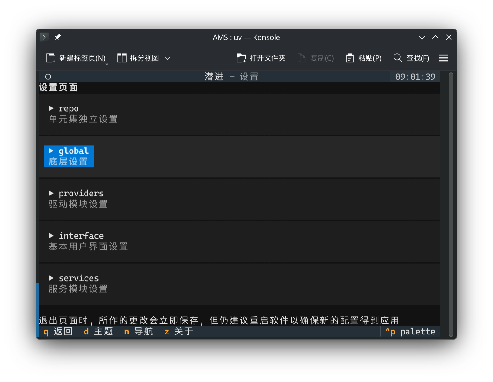
  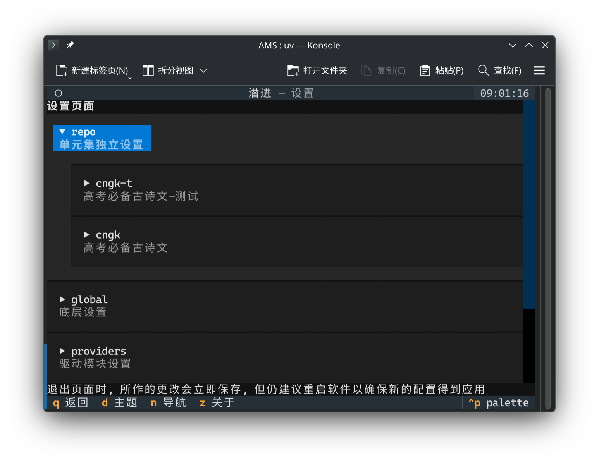

### 其他界面

收藏管理器可管理您手动标记的个人收藏集.  
关于页面提供了程序版本号、许可协议等信息.  

  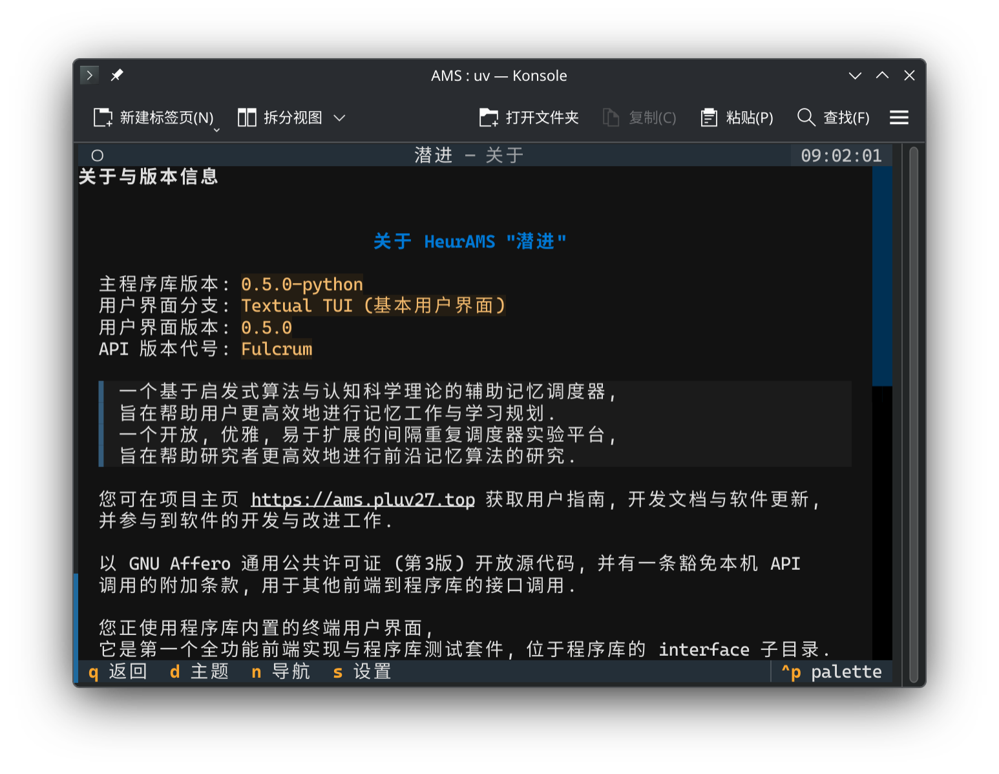
  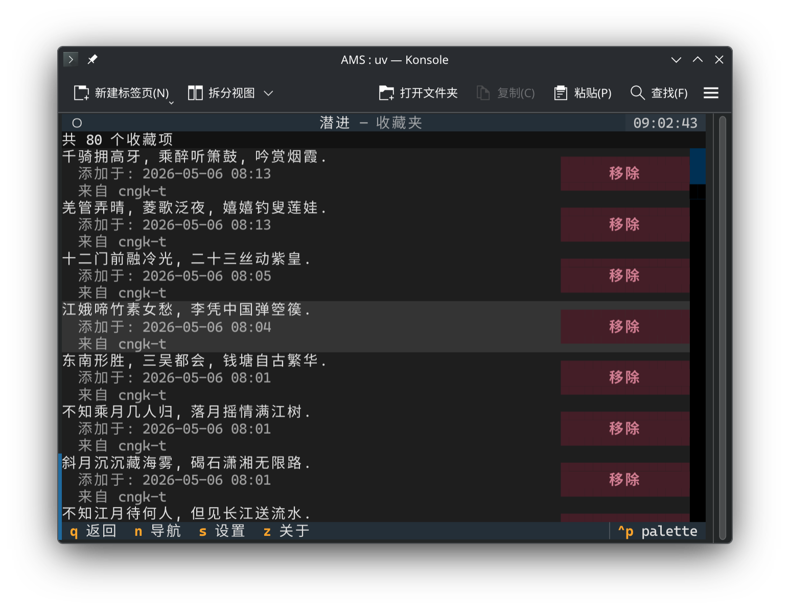

## KiriMemo 前端的截图

截图将在 KiriMemo 前端开发趋于稳定后补充.
<!-- TODO: 补充截图 -->
